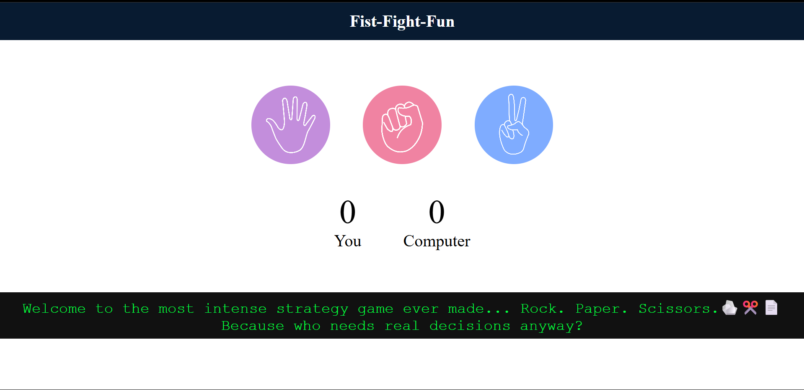

# 🪨✂️📄 Rock Paper Scissors - The Ultimate Hand Showdown!

A fun, responsive, and interactive **Rock Paper Scissors** game built using pure **HTML, CSS, and JavaScript**.  
Challenge the computer and see if you can outsmart... well, random chance!


## 🎮 Features

- 👆 Click-based user interaction
- 🤖 Random computer moves
- 🎯 Live score tracking
- 🧠 Funny, sarcastic messages on win, lose, or draw
- 📱 Fully responsive design
- 💡 Clean and readable code

---

## 🛠️ Tech Stack

| Frontend | Language |
|----------|----------|
| HTML5    | JavaScript |
| CSS3     |           |

---

## 📸 Screenshots



---

## 🧩 Game Rules

- Rock beats Scissors
- Scissors beats Paper
- Paper beats Rock
- Same choices = It's a draw!

---

## 📂 How to Run Locally

```bash
# 1. Clone the repo
git clone https://github.com/your-username/tic-tac-toe.git

# 2. Navigate into the folder
cd tic-tac-toe

# 3. Open index.html in your browser


